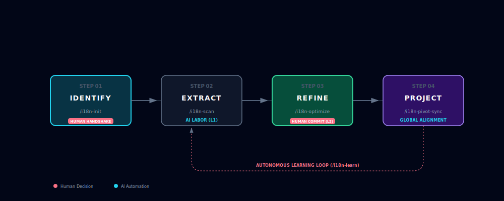

# i18n-agent-skill 🌐

[English] | [简体中文](./README.zh-CN.md)

> **Industrial-grade frontend internationalization (i18n) lifecycle automation for AI coding assistants.**

[](CHANGELOG.md)
[](https://github.com/FrancyJGLisboa/agent-skill-creator)
[](https://tree-sitter.github.io/)
[](LICENSE)

**i18n-agent-skill** provides full-lifecycle orchestration for internationalization within AI-native development workflows. By leveraging deterministic AST parsing and a "human-in-the-loop" staging mechanism, it minimizes hardcoded string leakage while ensuring predictable and verified translation quality.

---

## 🔄 How It Works (Continuous Iteration)

**i18n-agent-skill** is designed to be a continuous companion during your development lifecycle. As you build new features or refactor old ones, the cycle repeats—getting smarter with every iteration.



1.  **Identify**: The AI performs a "handshake" with your project to understand its unique tone (e.g., *Financial Professional*). Done once at setup.
2.  **Extract & Audit**: Whenever you add new pages or logic, the AI precision-scans the AST to capture new strings and find missing translations.
3.  **Refine & Commit**: AI experts polish your draft in a staging area. Once you **Commit**, the system learns these choices and locks them as "Policy."
4.  **Sync**: Verified high-quality translations are projected globally to all other languages instantly.
5.  **Iterate**: Developing a new feature? Jump back to **Step 2**. Your i18n assets now evolve in lock-step with your code.

---

## 🚀 AI-Native Setup (Zero Manual Steps)

You don't need to manually clone or install. Simply provide this repository URL to your **AI Coding Assistant** (Cursor, Claude Code, Gemini CLI, etc.) and say:

> "Please set up this i18n skill for me in this project."

**What your AI Assistant will do autonomously:**
1.  **Clone** the repository to a local hidden directory.
2.  **Bootstrap** the environment via `./install.sh --local` (Non-blocking).
3.  **Initialize** the project configuration using `/i18n-init`.
4.  **Confirm** readiness via `/i18n-status`.

---

## 🛡️ Technical Pillars

### 1. Deterministic AST Parsing
Unlike fragile RegEx-based extractors, our engine uses **Tree-sitter AST** to navigate code structure.
- **Structural Accuracy**: Correctness in complex JSX/TSX nesting and template literals.
- **Zero-Noise Isolation**: Automatically ignores comments and non-UI code blocks.
- **Multi-Format Parsing**: Robust support for JSON, YAML, and JS/TS object-literal locale files.

### 2. Privacy Shield (Secure by Design)
Built for enterprise security. Your source code and sensitive data stay in your local environment.
- **Local Masking**: Automatically identifies and masks PII (Emails, API Keys, IPs) before AI interaction.
- **Deterministic Hashing**: Tracks changes via local hashes without ever uploading content.

### 3. State-Based Quality Evolution
Manages the translation lifecycle to prevent regressions and improve phrasing over time.
- **State Machine**: Tracks every key from `DRAFT` to `REVIEWED` and `APPROVED`.
- **Glossary Learning**: Automatically learns preferred terminology from manual human corrections.
- **Typography Linter**: Built-in rules for CJK-Western spacing and professional punctuation.

---

## 🌍 Language Support Matrix

| Language Family | Extraction (AST) | Translation (AI) | Typography Linting | Status |
| :--- | :---: | :---: | :---: | :--- |
| **English / Western** | ✅ | ✅ | ✅ | **Production** |
| **CJK (ZH, JA, KO)** | ✅ | ✅ | ✅ | **Production** |
| **European (Latin)** | ✅ | ✅ | ✅ | **Stable** |
| **RTL (Arabic, Hebrew)**| ✅ | ✅ | ⚠️ (Bypass) | **Beta (Sync only)** |
| **Other (Hindi, Thai)** | ✅ | ✅ | ⚠️ (Bypass) | **Beta (Sync only)** |

> **Note**: Professional typography rules (e.g., CJK spacing) are currently optimized for language families marked as "✅".

---

## 📖 Core Command Set (AI & Human Reference)

| Command | Capability | Detailed Functional Description |
| :--- | :--- | :--- |
| `/i18n-init` | **Initialization** | Scans project structure and generates an explicit `.i18n-skill.json` configuration. |
| `/i18n-status` | **Health Check** | Verifies dependencies, environment isolation, and current VCS (Git) state. |
| `/i18n-scan` | **Extraction** | Precision scan of source code to find hardcoded strings. Use `--path` for specific components. |
| `/i18n-audit` | **Gap Analysis** | Compares locale files against source code to find missing keys or detect unused "dead keys". |
| `/i18n-sync` | **Smart Staging** | Generates translation proposals. Merges new keys into a staging area with Markdown preview. |
| `/i18n-commit` | **Apply Changes** | Formally writes approved proposals to physical locale files and updates quality snapshots. |
| `/i18n-cleanup` | **Debt Control** | Specifically identifies and reports unused i18n keys to keep locale files lean. |
| `/i18n-audit-quality` | **Expert Audit** | Generates a quality report focusing on phrasing, variable safety, and typography. |
| `/i18n-pivot-sync` | **Projection** | Optimizes target languages based on a familiar reference language (e.g., zh-CN). |
| `/i18n-fix` | **Auto-Repair** | Diagnoses environment or configuration issues and proposes recovery steps. |

---

## 🤖 Integration Blueprint

The installer automatically detects and deploys to your preferred Agent environment:

| Agent / Editor | Integration Method | Target Path |
| :--- | :--- | :--- |
| **Cursor** | Native Rules | `.cursor/rules/` (Auto-generated .mdc) |
| **Claude Code** | Global Skills | `~/.claude/skills/` |
| **Gemini CLI** | User Skills | `~/.gemini/skills/` |
| **Windsurf / Trae** | Global Rules | `.codeium/windsurf/rules/` / `.trae/rules/` |
| **Generic ADK** | Universal Path | `~/.agents/skills/` |

---

## 📂 Project Structure

```text
i18n-agent-skill/
├── i18n_agent_skill/   # Core Python logic package
├── scripts/            # Automation: installers, cleanup, and wrappers
├── references/         # Knowledge base: AST engine, Privacy Guard, Linting specs
├── assets/             # Templates: glossary, persona blueprints
├── tests/              # Full suite: Unit, integration, and resilience tests
├── SKILL.md            # Execution protocol (v4.0 Spec)
└── pyproject.toml      # Dependency and project index
```

---

## 🛠 Engineering Quality

This project maintains industrial-grade standards through automated verification tools:

```bash
# 1. Full Quality Audit (Ruff Format/Lint + Mypy Type Check)
python scripts/check.py

# 2. Automated Test Suite (58+ Unit & Integration Tests)
pytest

# 3. Protocol Compliance (Optional)
python .agents/skills/agent-skill-creator/scripts/validate.py .
```

---

## 🔒 Security & Privacy

We guarantee that **zero source code** is uploaded to third-party servers. All AST parsing, de-identification, and suggestion generation occur locally. AI agents only receive masked snippets required for translation assistance under your explicit permission.

---

## 💖 Support the Project

If you find **i18n-agent-skill** helpful, please consider:
- Giving the project a **Star** ⭐ to show your support.
- **Afdian (爱发电)**: [https://ifdian.net/a/shirolin](https://ifdian.net/a/shirolin)
- **Ko-fi**: [https://ko-fi.com/shirolin](https://ko-fi.com/shirolin)

---

---

## 🔍 Deep Dive

- **[Product Scenarios](./references/product-scenarios.md)**: Detailed 5-phase lifecycle and authority hierarchy (L1-L3).
- **[AST Engine](./references/ast-engine.md)**: How our Tree-sitter integration ensures pixel-perfect extraction.
- **[Privacy Guard](./references/privacy-guard.md)**: Specification for local data masking and security.

## 📄 License

Licensed under [Apache-2.0](LICENSE).
