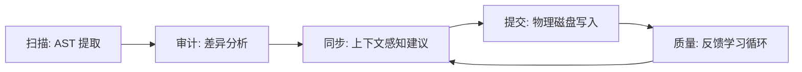

# i18n-agent-skill 🌐

[English](../README.md) | [简体中文]

> **面向 AI 助理的前端国际化 (i18n) 全生命周期自动化工业级方案。**

[](CHANGELOG.md)
[](https://github.com/FrancyJGLisboa/agent-skill-creator)
[](https://tree-sitter.github.io/)
[](LICENSE)

**i18n-agent-skill** 旨在解决 AI 原生开发流中国际化处理的复杂性。通过确定性的 AST 解析和上下文感知的状态管理，它在源代码与全球化翻译文件之间建立了一座安全、可预测且全自动的桥梁。

---

## 🔄 自动化国际化闭环 (i18n Loop)

本技能实现了国际化流程的全闭环自动化，确保硬编码文案零遗漏，并由人工最终校验翻译质量。



---

## 🚀 AI 原生安装 (快速上手)

推荐的安装方式是让您的 **AI 助手** 自动完成环境配置。

1. **克隆本仓库** 到您的项目目录。
2. **对您的 AI 助手说**：
   > “帮我局部安装这个 i18n 技能并检查项目状态。”

助手将自动执行 `./install.sh --local` 并运行 `/i18n-status` 以就绪您的开发环境。

---

## 🛡️ 技术支柱

### 1. 确定性 AST 解析
不同于脆弱的正则提取，我们的引擎基于 **Tree-sitter AST** 深度理解代码结构。
- **结构化精度**：完美处理 JSX/TSX 复杂嵌套及模板字符串。
- **零干扰隔离**：自动忽略注释及非 UI 相关代码块。
- **多格式解析**：稳定支持 JSON, YAML 以及 JS/TS 对象字面量格式。

### 2. 隐私盾 (Secure by Design)
专为企业级安全设计，确保源码与敏感数据不出本地环境。
- **本地脱敏**：在 AI 交互前自动识别并遮蔽 PII 信息（邮件、API 密钥、IP 等）。
- **确定性哈希**：通过本地哈希追踪变更，无需上传原始内容。

### 3. 基于状态的质量进化
管理翻译全生命周期，防止质量倒退并随时间优化表达。
- **状态机管理**：追踪每个 Key 从 `DRAFT` (草稿) 到 `REVIEWED` (已审阅) 及 `APPROVED` (已批准) 的状态。
- **术语学习**：从人工修正中自动提取并学习项目专属词汇表。
- **排版审计**：内置中西文空格、标点一致性等专业校对规则。

---

## 🌍 语言支持矩阵

| 语系 | 源码提取 (AST) | AI 翻译 | 排版审计 (Linter) | 状态 |
| :--- | :---: | :---: | :---: | :--- |
| **英语 / 西方语系** | ✅ | ✅ | ✅ | **生产级** |
| **中日韩 (CJK)** | ✅ | ✅ | ✅ | **生产级** |
| **欧洲语系 (拉丁)** | ✅ | ✅ | ✅ | **稳定版** |
| **RTL (阿拉伯、希伯来)**| ✅ | ✅ | ⚠️ (安全跳过) | **测试版 (仅支持同步)** |
| **其他 (印地语、泰语)** | ✅ | ✅ | ⚠️ (安全跳过) | **测试版 (仅支持同步)** |

> **注意**：专业的排版校对规则（如中西文混排空格）目前仅针对标记为“✅”的语系进行了深度优化。

---

## 📖 核心指令集 (AI 与开发者参考)

| 指令 | 能力 | 详细功能说明 |
| :--- | :--- | :--- |
| `/i18n-init` | **项目初始化** | 扫描项目结构并生成显式的 `.i18n-skill.json` 配置文件。 |
| `/i18n-status` | **环境自检** | 验证依赖环境、隔离沙箱就绪度及当前 VCS (Git) 状态。 |
| `/i18n-scan` | **文案提取** | 对源码进行精准 AST 扫描以发现硬编码文案。支持使用 `--path` 指定组件。 |
| `/i18n-audit` | **缺漏审计** | 对比语言包与源码，找出缺失的翻译项或探测未引用的“死键”。 |
| `/i18n-sync` | **智能暂存** | 生成翻译同步建议书，将新 Key 合并至带 Markdown 预览的暂存区。 |
| `/i18n-commit` | **正式提交** | 将已批准的建议正式写入物理磁盘，并更新质量回归快照。 |
| `/i18n-cleanup` | **技术债清理** | 专门识别并报告语言包中冗余的 Key，保持翻译文件精简。 |
| `/i18n-audit-quality` | **专家级巡检** | 生成质量报告，重点审查表达习惯、变量安全及排版规范。 |
| `/i18n-pivot-sync` | **语义对齐** | 基于开发者熟悉的母语（如中文）作为基准，对齐并优化目标语言。 |
| `/i18n-fix` | **自动修复** | 诊断环境或配置异常，并自动提出恢复方案建议。 |

---

## 🤖 助手集成蓝图

安装程序会自动将技能部署至您偏好的 Agent 环境：

| 助手 / 编辑器 | 集成方式 | 部署目标路径 |
| :--- | :--- | :--- |
| **Cursor** | 原生规则 | `.cursor/rules/` (自动生成 .mdc) |
| **Claude Code** | 全局技能 | `~/.claude/skills/` |
| **Gemini CLI** | 用户技能 | `~/.gemini/skills/` |
| **Windsurf / Trae** | 全局规则 | `.codeium/windsurf/rules/` / `.trae/rules/` |
| **通用 ADK 路径** | 行业标准 | `~/.agents/skills/` |

---

## 📂 项目结构

```text
i18n-agent-skill/
├── i18n_agent_skill/   # 核心 Python 逻辑包
├── scripts/            # 自动化脚本：安装程序、清理工具及 CLI 包装
├── references/         # 知识库：AST 引擎原理、隐私协议、Lint 规范
├── assets/             # 资源模板：词汇表、Persona 蓝图等
├── tests/              # 全量测试套件：单元、集成及鲁棒性测试
├── SKILL.md            # 核心执行协议 (v4.0 规范)
└── pyproject.toml      # 依赖管理与项目索引
```

---

## 🛠 开发与自检

本项目集成了工业级标准验证工具：

```bash
# 执行协议合规性验证
python .agents/skills/agent-skill-creator/scripts/validate.py .

# 执行安全扫描
python .agents/skills/agent-skill-creator/scripts/security_scan.py .

# 运行全量测试
pytest
```

---

## 🔒 安全与隐私承诺

我们承诺**绝不将源代码**上传至第三方服务器。所有的 AST 解析、脱敏处理和建议生成均在您的本地环境完成。AI 代理仅在您明确许可的情况下获取翻译所需的脱敏片段。

---

## 💖 支持本项目

如果您觉得 **i18n-agent-skill** 对您有所帮助，请考虑：
- 给项目点一个 **Star** ⭐ 以表鼓励。
- **爱发电**: [https://ifdian.net/a/shirolin](https://ifdian.net/a/shirolin)
- **Ko-fi**: [https://ko-fi.com/shirolin](https://ko-fi.com/shirolin)

---

## 📄 开源协议

基于 [Apache-2.0](LICENSE) 协议开源。
