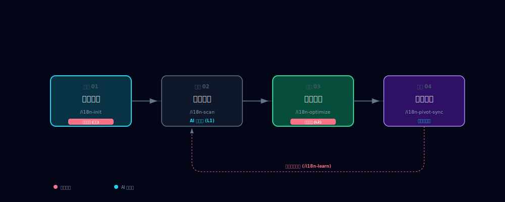

# i18n-agent-skill 🌐

[English](../README.md) | [简体中文]

> **面向 AI 助理的前端国际化 (i18n) 全生命周期自动化工业级方案。**

[](CHANGELOG.md)
[](https://github.com/FrancyJGLisboa/agent-skill-creator)
[](https://tree-sitter.github.io/)
[](LICENSE)

**i18n-agent-skill** 实现了国际化流程的全链路自动化调度。通过确定性的 AST 精准扫描**显著降低**文案遗漏风险，并配合“人在回路”的暂存校验机制确保翻译质量的可预测与可验证。

---

## 🔄 运行机制 (持续迭代循环)

**i18n-agent-skill** 设计为软件开发全生命周期的常驻伙伴。随着您不断开发新功能或重构旧代码，该循环将周而复始——让您的国际化资产随代码同步进化。



1.  **确定画像**：AI 与项目进行“人机握手”，理解其独特的行业定调（如：*金融专业*）。仅需在初始化时执行一次。
2.  **提取与审计**：每当您新增页面或逻辑，AI 将通过 AST 精准扫描捕获新文案并发现翻译缺失。
3.  **润色与确认**：AI 专家在暂存区对初稿进行深度润色。一旦您执行 **Commit**，系统将学习这些偏好并将其锁定为项目准则。
4.  **全球同步**：经人工确认的高质量翻译将瞬间投影至全球所有其他语种。
5.  **周而复始**：开发了新功能？跳回**步骤 2**。您的多语言资产现在与代码保持 1:1 的同步进化。

---

## 🚀 安装

### 方式一：让 AI 帮你安装（推荐）

将以下任意一句话发送给你的 **AI 编码助手**（Cursor, Claude Code, Gemini CLI 等）：

**一键配置（推荐）**
```text
帮我在当前项目中配置好这个 i18n 技能并完成初始化：https://github.com/Shirolin/i18n-agent-skill
```

AI 将自动完成克隆，运行安装程序，并立即执行 `./i18n init --auto`。

### 方式二：手动安装

```bash
# 工作区安装（推荐，适用于单个项目）
git clone --depth 1 https://github.com/Shirolin/i18n-agent-skill .agents/skills/i18n-agent-skill
cd .agents/skills/i18n-agent-skill

# 运行安装脚本
./install.sh       # Linux / macOS
.\install.ps1      # Windows (PowerShell)
```

安装完成后，在项目根目录下运行初始化命令：
```bash
# 如果使用 MCP/平台支持可直接输入 /i18n-init，或直接运行：
python -m i18n_agent_skill init
```

### 升级

```bash
cd <安装路径>/i18n-agent-skill
git pull
./install.sh       # Linux / macOS
.\install.ps1      # Windows (PowerShell)
```

技能会自动检测是否有新版本可用并通知你。

---

## 🛡️ 技术支柱

### 1. 确定性 AST 解析
不同于脆弱的正则提取，我们的引擎基于 **Tree-sitter AST** 深度理解代码结构。
- **结构化精度**：完美处理 JSX/TSX 复杂嵌套及模板字符串。
- **零干扰隔离**：自动忽略注释及非 UI 相关代码块。
- **多格式解析**：稳定支持 JSON, YAML 以及 JS/TS 对象字面量格式。

### 2. 隐私盾 (Secure by Design)
专为企业级安全设计，确保源码与敏感数据不出本地环境。
- **本地脱敏**：在 AI 交互前自动识别并遮蔽 PII 信息（邮件、API 密钥、IP 等）。
- **确定性哈希**：通过本地哈希追踪变更，无需上传原始内容。

### 3. 基于状态的质量进化
管理翻译全生命周期，防止质量倒退并随时间优化表达。
- **状态机管理**：追踪每个 Key 从 `DRAFT` (草稿) 到 `REVIEWED` (已审阅) 及 `APPROVED` (已批准) 的状态。
- **术语学习**：从人工修正中自动提取并学习项目专属词汇表。
- **排版审计**：内置中西文空格、标点一致性等专业校对规则。

---

## 🌍 语言支持矩阵

| 语系 | 源码提取 (AST) | AI 翻译 | 排版审计 (Linter) | 状态 |
| :--- | :---: | :---: | :---: | :--- |
| **英语 / 西方语系** | ✅ | ✅ | ✅ | **生产级** |
| **中日韩 (CJK)** | ✅ | ✅ | ✅ | **生产级** |
| **欧洲语系 (拉丁)** | ✅ | ✅ | ✅ | **稳定版** |
| **RTL (阿拉伯、希伯来)**| ✅ | ✅ | ⚠️ (安全跳过) | **测试版 (仅支持同步)** |
| **其他 (印地语、泰语)** | ✅ | ✅ | ⚠️ (安全跳过) | **测试版 (仅支持同步)** |

> **注意**：专业的排版校对规则（如中西文混排空格）目前仅针对标记为“✅”的语系进行了深度优化。

---

## 📖 核心指令集 (AI 与开发者参考)

| 指令 | 能力 | 详细功能说明 |
| :--- | :--- | :--- |
| `/i18n-init` | **项目初始化** | 扫描项目结构并生成显式的 `.i18n-skill.json` 配置文件。 |
| `/i18n-status` | **环境自检** | 验证依赖环境、隔离沙箱就绪度及当前 VCS (Git) 状态。 |
| `/i18n-scan` | **文案提取** | 对源码进行精准 AST 扫描以发现硬编码文案。支持使用 `--path` 指定组件。 |
| `/i18n-audit` | **缺漏审计** | 对比语言包与源码，找出缺失的翻译项或探测未引用的“死键”。 |
| `/i18n-sync` | **智能暂存** | 生成翻译同步建议书，将新 Key 合并至带 Markdown 预览的暂存区。 |
| `/i18n-commit` | **正式提交** | 将已批准的建议正式写入物理磁盘，并更新质量回归快照。 |
| `/i18n-cleanup` | **技术债清理** | 专门识别并报告语言包中冗余的 Key，保持翻译文件精简。 |
| `/i18n-audit-quality` | **专家级巡检** | 生成质量报告，重点审查表达习惯、变量安全及排版规范。 |
| `/i18n-pivot-sync` | **语义对齐** | 基于开发者熟悉的母语（如中文）作为基准，对齐并优化目标语言。 |
| `/i18n-fix` | **自动修复** | 诊断环境或配置异常，并自动提出恢复方案建议。 |

---

## 🤖 集成方式

本技能遵循 **Agent Skills Open Standard (ADK)** 规范，安装到通用标准路径：

| 安装范围 | 路径 | 生效范围 |
| :--- | :--- | :--- |
| **工作区** | `.agents/skills/i18n-agent-skill/` | 仅当前项目中的 ADK 兼容 Agent |
| **全局** | `~/.agents/skills/i18n-agent-skill/` | 系统全局的 ADK 兼容 Agent |

对于尚未支持 ADK 路径的平台，可运行 `./install.sh --link-platforms` 创建可选软链接（如 `~/.gemini/skills/`、`~/.claude/skills/`）。

---

## 📂 项目结构

```text
i18n-agent-skill/
├── i18n_agent_skill/   # 核心 Python 逻辑包
├── scripts/            # 自动化脚本：安装程序、清理工具及 CLI 包装
├── references/         # 知识库：AST 引擎原理、隐私协议、Lint 规范
├── assets/             # 资源模板：词汇表、Persona 蓝图等
├── tests/              # 全量测试套件：单元、集成及鲁棒性测试
├── SKILL.md            # 核心执行协议 (v4.0 规范)
└── pyproject.toml      # 依赖管理与项目索引
```

---

## 🛠 工程质量保证 (Engineering Quality)

本项目通过自动化验证工具维持工业级标准：

```bash
# 1. 全量质量审计 (Ruff 格式化/扫描 + Mypy 类型检查)
python scripts/check.py

# 2. 自动化测试套件 (58+ 项单元与集成测试)
pytest

# 3. 协议合规性验证 (可选)
python .agents/skills/agent-skill-creator/scripts/validate.py .
```


---

## 🔒 安全与隐私承诺

我们承诺**绝不将源代码**上传至第三方服务器。所有的 AST 解析、脱敏处理和建议生成均在您的本地环境完成。AI 代理仅在您明确许可的情况下获取翻译所需的脱敏片段。

---

## 💖 支持本项目

如果您觉得 **i18n-agent-skill** 对您有所帮助，请考虑：
- 给项目点一个 **Star** ⭐ 以表鼓励。
- **爱发电**: [https://ifdian.net/a/shirolin](https://ifdian.net/a/shirolin)
- **Ko-fi**: [https://ko-fi.com/shirolin](https://ko-fi.com/shirolin)

---

---

## 🔍 深度解析

- **[产品场景规格书](./references/product-scenarios.md)**：详细的 5 阶段生命周期与权责等级制度 (L1-L3)。
- **[AST 引擎原理](./references/ast-engine.md)**：深入了解 Tree-sitter 如何实现像素级的文案提取。
- **[隐私保护协议](./references/privacy-guard.md)**：本地脱敏机制与安全加固规范。

## 📄 开源协议

基于 [Apache-2.0](LICENSE) 协议开源。
